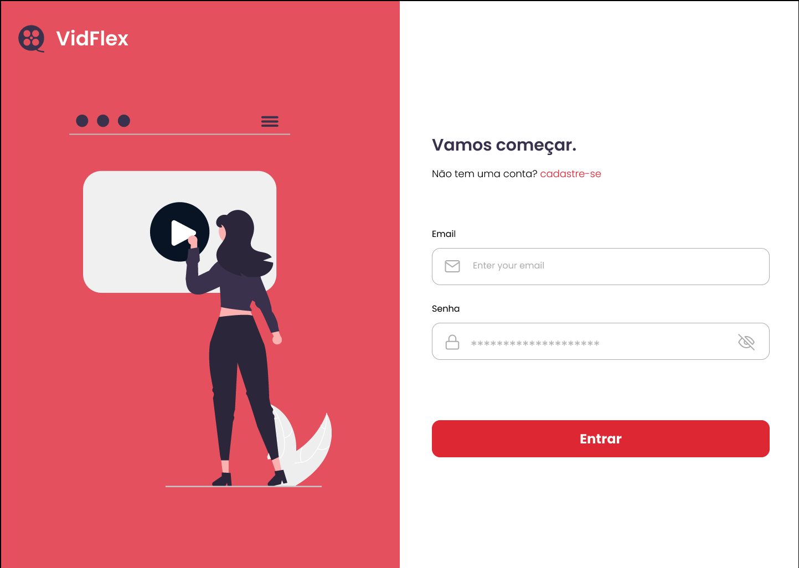
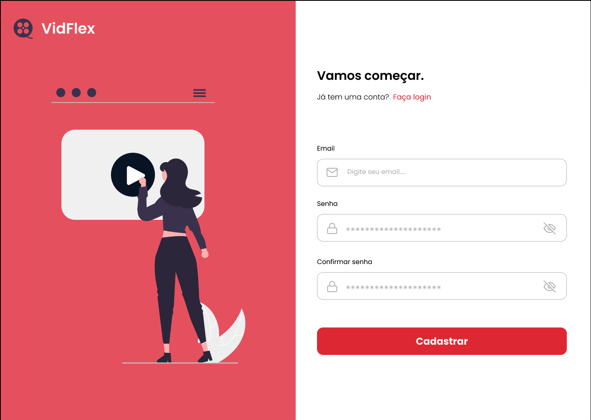
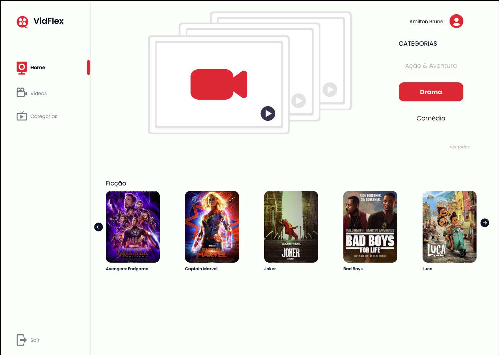
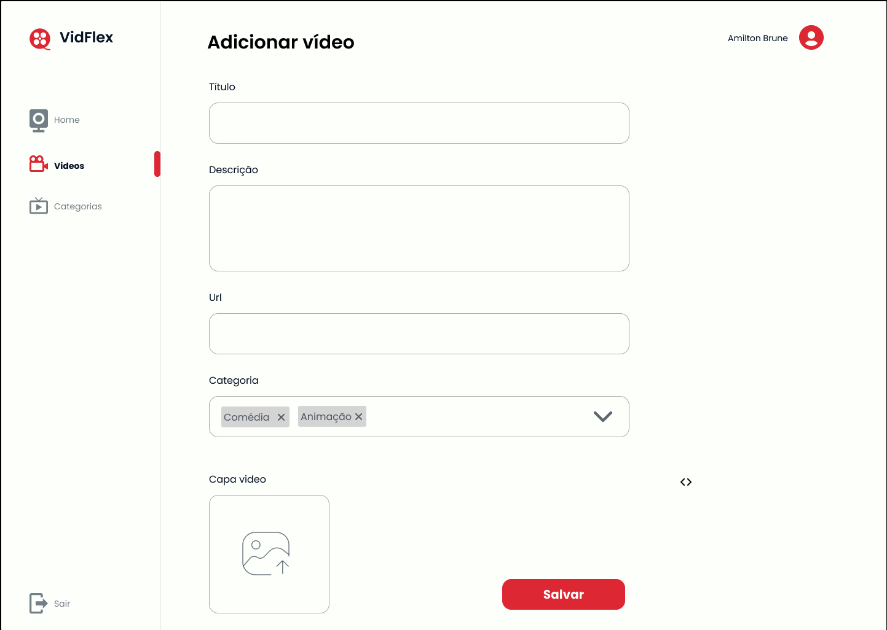
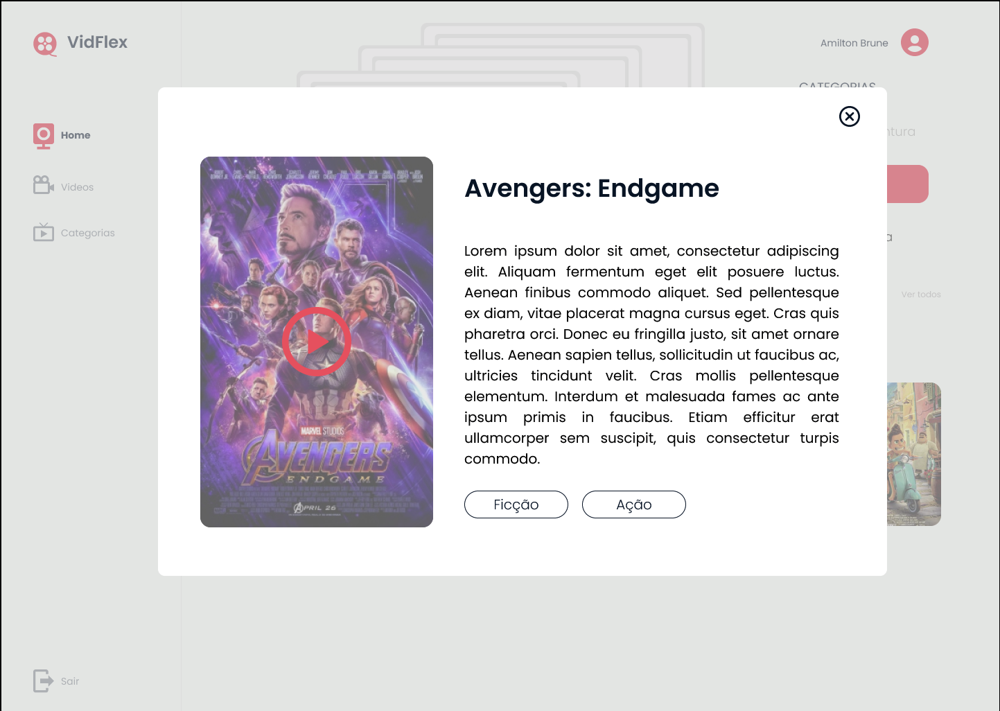
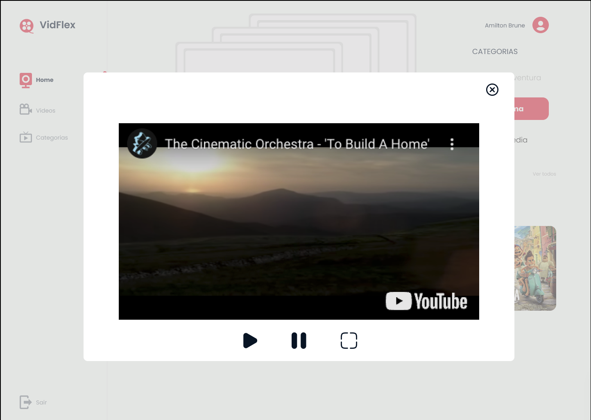
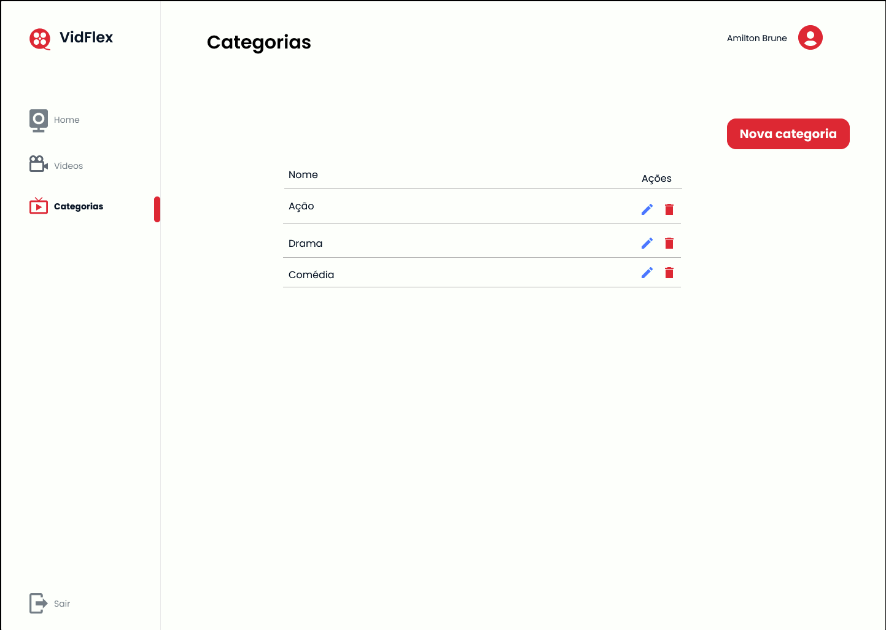
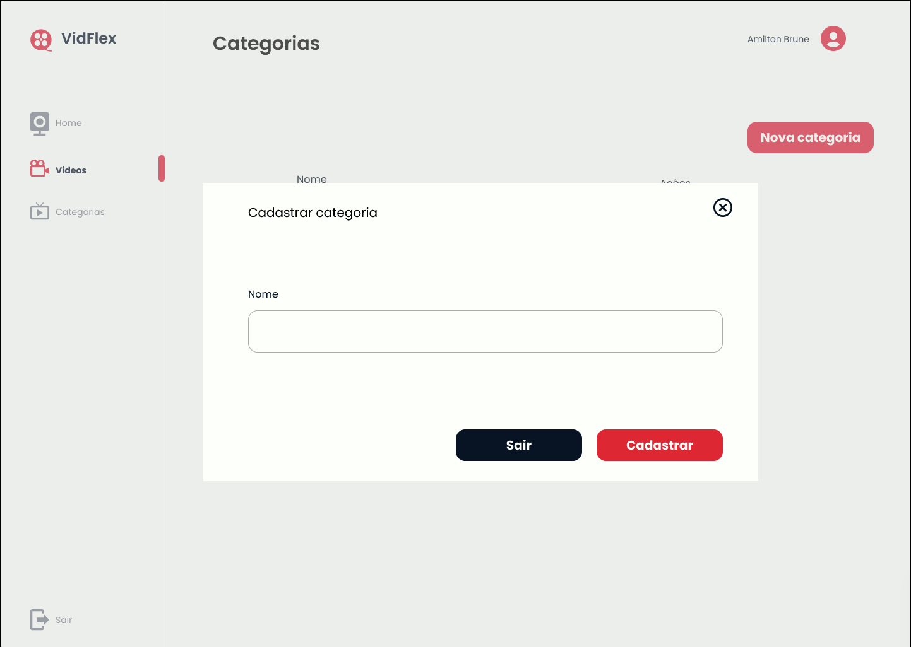

# OTT Application Development

  

Este repositório contém o código-fonte e a documentação para o desenvolvimento de um aplicativo OTT que permite aos usuários criar e personalizar sua própria galeria de vídeos.

### Design das páginas

- **Login:**

- **Cadastro:**

- **Home:**

- **Adicionar video:**

- **Detalhe Vídeo:**

- **Video:**

- **Categorias:**

- **Adicionar categoria:**

