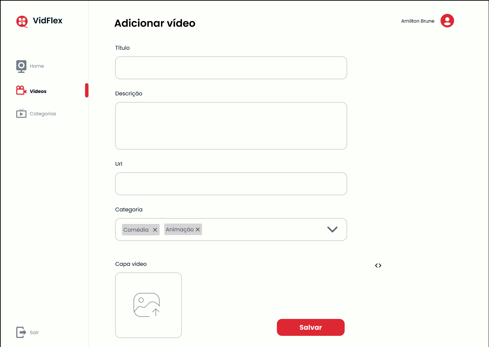
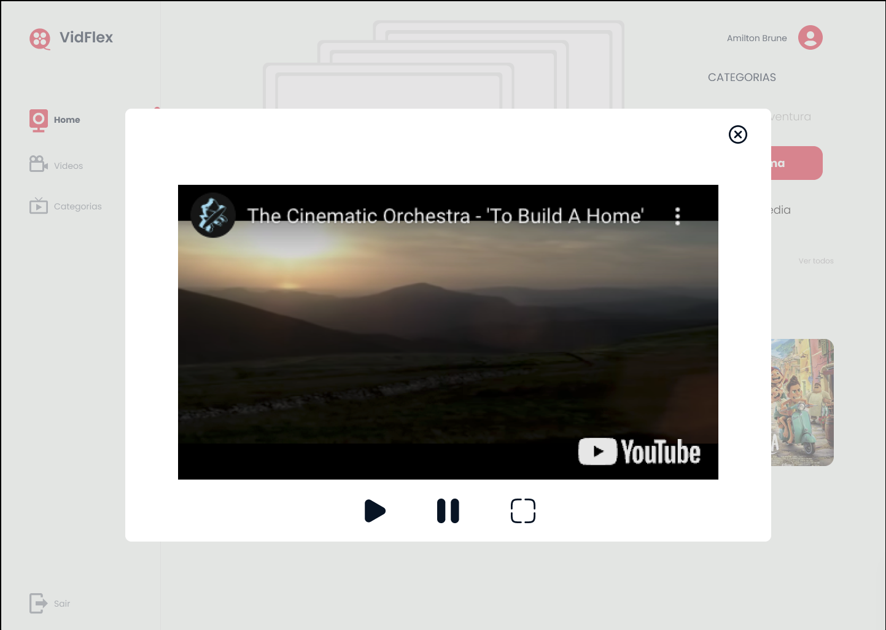

### Design das páginas

   <a href="https://www.figma.com/proto/LEwd7g21gMIPffBBHJBVMw/VidFlex?node-id=18-2328&t=hnIUSaS7b7Cqmm8b-1&scaling=min-zoom&page-id=0%3A1&starting-point-node-id=18%3A2328">
   
   Ver no figma
   </a>
  

- **Login:**

- **Cadastro:**

- **Home:**

- **Adicionar video:**

- **Detalhe Vídeo:**

- **Video:**

- **Categorias:**

- **Adicionar categoria:**

